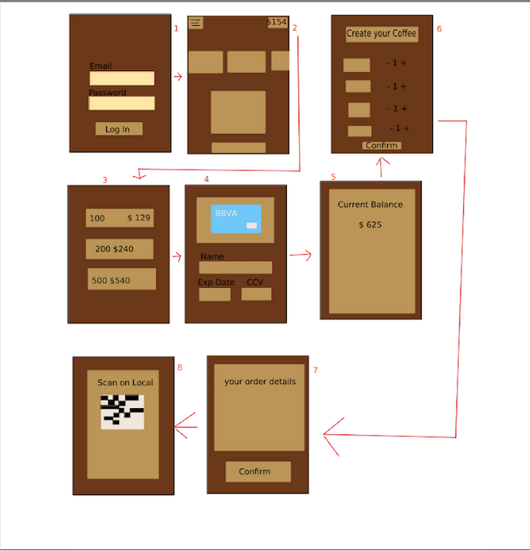

<h1> Low fidelity Mock Up </h1>

 This is a Mock Up test for an mobile app that sells Coffee 
 

 First we have a login, then after login you a menu section with all of the combos and flavors, but also you have a create your custom coffee where you can select the ingredients manualiy,
  then you can add cash to your account after adding the bank account data then you confirm the order and after that you get a QR code that you can scan on any local to get your coffee

 

<h1> High fidelity Mock Up </h1>

The documentation was made in UXpin as well

<a>https://preview.uxpin.com/0329fe43bc624072017df03f4ad8d91716f6ef9a#/pages/165259011/simulate/no-panels</a>
